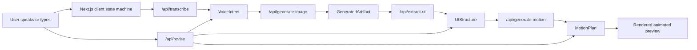

# Voice To Motion UI Architecture

## Purpose

Voice To Motion UI is a LinkedIn-ready proof-of-possibility demo. It shows how a spoken product idea can move through a controlled AI pipeline:

1. Voice prompt is captured and transcribed.
2. Intent is normalized into product, style, and constraints.
3. An image direction is generated.
4. The image is analyzed into UI structure and design tokens.
5. A motion plan is generated.
6. The preview renders from state.
7. A follow-up voice revision updates the smallest affected layer.

The first version is mock-first so we can make the demo visually strong before spending realtime/image API budget.

## Architecture Diagram

Editable Excalidraw source:

- `diagrams/voice-to-motion-architecture.excalidraw`

The diagram can be edited in Excalidraw. Keep local editor tooling out of the public repo unless it is required for contributors.

## System Shape



## Runtime Layers

### Frontend Layer

Current home screen lives in `app/page.tsx`.

Responsibilities:

- Owns the visible demo state and phase transitions.
- Captures voice through `MediaRecorder`.
- Sends audio to `/api/transcribe`.
- Plays a mock pipeline through these phases:
  - `listening`
  - `transcribing`
  - `generating_image`
  - `extracting_ui`
  - `planning_motion`
  - `preview_ready`
  - `revising`
- Renders the calm product surface:
  - `VoicePrompt`
  - `ArtifactPreview`
  - `ActivityTrace`
  - `StructureDrawer`
  - `MotionTimeline`
  - `ToolCallRow`

Near-term enhancement: split the current inline components into files under `components/` and move pipeline orchestration into `lib/pipeline.ts`.

### API Layer

Server routes live under `app/api`.

| Route | Job | Current Mode |
|---|---|---|
| `/api/transcribe` | Audio to transcript | Mock by default, OpenAI transcription when enabled |
| `/api/generate-image` | Prompt to visual direction | Mock by default, image API when enabled |
| `/api/extract-ui` | Image and prompt to UI JSON | Mock by default, Responses vision/structured output when enabled |
| `/api/generate-motion` | UI structure to timeline JSON | Mock by default, Responses structured output when enabled |
| `/api/revise` | Voice/text revision against current state | Mock by default, model-assisted revision when enabled |

Near-term enhancement: add `/api/turn` as the single voice-turn router. That route should decide whether a new transcript is a fresh generation, a revision, a retry, or an export request.

### Contract Layer

Shared contracts live in `lib/contracts.ts`.

Important data types:

- `VoiceIntent`: transcript, style intent, product intent, constraints.
- `GeneratedArtifact`: selected generated visual direction.
- `UIStructure`: layout, components, tokens, copy, interactions.
- `MotionPlan`: tracks, duration, delay, easing.
- `DemoState`: one serializable state object for the whole visible demo.

Near-term enhancement: use Zod or another schema validator so route outputs are validated before the UI renders them.

## AutoPreso-Inspired Live Loop

The useful pattern from AutoPreso is not the whiteboard itself. It is the live loop:

```txt
audio input -> transcript turn -> agent decision -> typed tool call -> visual state mutation
```

For Voice To Motion UI, that becomes:

```txt
spoken idea -> transcript turn -> layer decision -> typed pipeline tool -> rendered artifact state
```

Recommended implementation:

1. Add a transcript turn queue.
2. Wait for a short quiet window before committing a turn.
3. Send the committed turn to `/api/turn`.
4. Return a typed action:
   - `start_generation`
   - `revise_intent`
   - `regenerate_image`
   - `regenerate_structure`
   - `regenerate_motion`
   - `export_schema`
5. Apply only the affected part of `DemoState`.

This keeps the demo fast, understandable, and cheaper than an always-on realtime assistant.

## Provider Modes

The app should keep provider choice explicit.

| Mode | Use | Notes |
|---|---|---|
| `mock` | Default demo and UI work | No API cost, deterministic recording path |
| `openai` | Real public/API-backed demo | Server-only `OPENAI_API_KEY` |
| `realtime` | Later live voice experience | Use selectively because realtime is expensive |
| `local-dev` | Optional local experiments | Never required for the public demo |

Environment rule:

```txt
VOICE_TO_MOTION_MOCK_MODE=true
```

should remain the default until the UI and recording story are polished.

## Diagram Plan

Keep the editable `.excalidraw` source in `diagrams/`. If contributors add a rendered PNG or SVG later, it should be generated from that source and referenced from the README.

## Build Roadmap

### Stage 1: Make The Static Demo Excellent

- Split components out of `app/page.tsx`.
- Add a central `DemoState` reducer.
- Add visible staging/live mode toggle.
- Improve animation states for generated artifact, structure rows, and timeline.

### Stage 2: Add The Voice Turn Loop

- Add `lib/turn-queue.ts`.
- Add `/api/turn`.
- Route transcript turns to typed actions.
- Apply partial state updates instead of replaying the full mock pipeline.

### Stage 3: Wire Real Generation Selectively

- Keep `/api/transcribe` inexpensive by using recorded audio and transcription.
- Use image generation only for deliberate runs.
- Use structured Responses routes for UI extraction and motion planning.
- Cache generated artifacts locally during demos.

### Stage 4: Make It A Builder Demo

- Render UI from `UIStructure`.
- Export React component state, motion JSON, and prompt history.
- Add voice revision examples:
  - "make it more premium"
  - "slow the confirmation"
  - "turn this into a mobile booking flow"
  - "show me the component tree"

## Demo Walkthrough

1. Open the app at `http://localhost:3000`.
2. Say: "Make a calm concierge booking flow for a premium studio."
3. Transcript locks and the activity trace starts.
4. Image direction appears in the central artifact.
5. Structure drawer populates with components and tokens.
6. Timeline activates and preview motion plays.
7. Say: "Make it more premium and slower."
8. Only the affected style/motion layers update.

## Design Guardrails

- Keep the center calm.
- Avoid a permanent dashboard feeling.
- Tool calls should be readable but quiet.
- The architecture should feel like a controlled pipeline, not a magic black box.
- Realtime should be reserved for moments where latency matters; transcription plus structured tool calls is the practical default.
